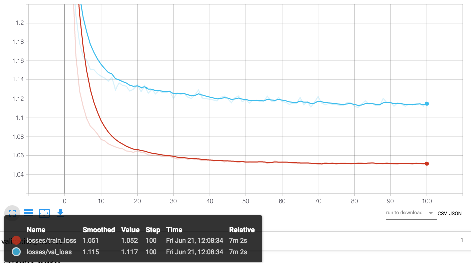
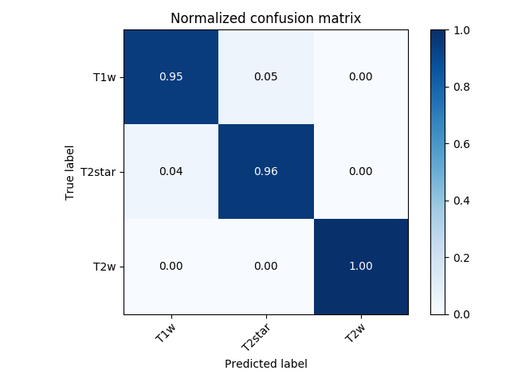
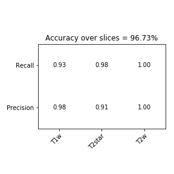
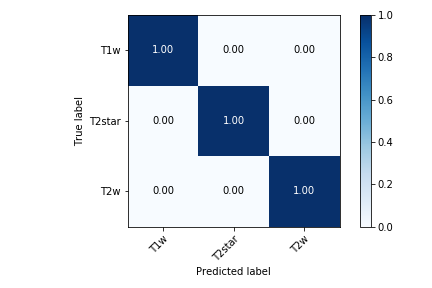

# MRI Spinal Cord modality Classifier

This is a repository for a generic tool of modality classification for MRI images. It is designed to learn from 3 classes (T1w, T2w, T2star) as described in the [spineGeneric protocol](https://github.com/sct-pipeline/spine-generic).
It is conceived for the purpose of the [IVADO medical Imaging project](https://osf.io/jyp2z/)

- [Files](#files)
- [Installing](#installing)
- [Training](#training)
- [Data](#data)


## Files

The actual code is comprised in the three python files `main.py`, `loader.py` and `model.py`.
The `config.json` and `config_small.json` are files that encapsulate all necessary parameters for training the model (find extensive information about it in `main.py`) and `config_small.json` allows faster training with fewer centers.

## Installing

This project requires Python 3.6 and PyTorch >= 1.0.1. We recommend using a virtual environment:

~~~
conda create -n classifier python=3.6
source activate classifier
~~~

Then, install all requirements using `pip`:

```
git clone https://github.com/bsauty/sc_mri_modality_detection
cd sc_mri_modality_detection
pip install -e .
```


## Training

To train the network, just prompt the `train_classifier` command that will appear after installation, example below:

```
train_classifier config/config.json
```

The `config.json` is a configuration example. A description of each parameter is provided in the code. 

After training is over a figure of the losses (training loss and validation loss) as well as the accuracy will be saved for visualization in tensorboard.




With the provided config file we reached over 95% accuracy for each slice which allows us to predict an acquisition's modality with an even higher accuracy. Below is the confusion matrix over the test centers listed in  `config.json` for each slice (more than 2000 slices).

 

We obtained a 100% accuracy for the full acquisitions over our testing dataset.




## Data

The working dataset is derived from the [Spinal Cord MRI Public Database](https://openneuro.org/datasets/ds001919). 

The data structure is compatible with [BIDS](http://bids.neuroimaging.io/) and is exemplified below:
~~~
site/
└── dataset_description.json
└── participants.tsv
└── sub-01
    └── anat
        └── sub-01_T1w_reg.nii.gz --> Processed (i.e. different than in the original SpineGeneric database)
        └── sub-01_T1w_reg.json
        └── sub-01_T2w_reg.nii.gz --> Processed
        └── sub-01_T2w_reg.json
        └── sub-01_acq-MTon_MTS_reg.nii.gz --> Processed
        └── sub-01_acq-MTon_MTS_reg.json
        └── sub-01_acq-MToff_MTS_reg.nii.gz --> Processed
        └── sub-01_acq-MToff_MTS_reg.json
        └── sub-01_acq-T1w_MTS.nii.gz --> Unprocessed (i.e. same as in the original SpineGeneric database)
        └── sub-01_acq-T1w_MTS.json
        └── sub-01_T2star_reg.nii.gz --> Processed
        └── sub-01_T2star_reg.json
└── derivatives
    └── labels
        └── sub-01
            └── anat
                └── sub-01_T1w_seg.nii.gz --> Spinal cord segmentation
~~~

## License

The MIT License (MIT)

Copyright (c) 2019 Polytechnique Montreal, Université de Montréal

Permission is hereby granted, free of charge, to any person obtaining a copy of this software and associated documentation files (the "Software"), to deal in the Software without restriction, including without limitation the rights to use, copy, modify, merge, publish, distribute, sublicense, and/or sell copies of the Software, and to permit persons to whom the Software is furnished to do so, subject to the following conditions:

The above copyright notice and this permission notice shall be included in all copies or substantial portions of the Software.

THE SOFTWARE IS PROVIDED "AS IS", WITHOUT WARRANTY OF ANY KIND, EXPRESS OR IMPLIED, INCLUDING BUT NOT LIMITED TO THE WARRANTIES OF MERCHANTABILITY, FITNESS FOR A PARTICULAR PURPOSE AND NONINFRINGEMENT. IN NO EVENT SHALL THE AUTHORS OR COPYRIGHT HOLDERS BE LIABLE FOR ANY CLAIM, DAMAGES OR OTHER LIABILITY, WHETHER IN AN ACTION OF CONTRACT, TORT OR OTHERWISE, ARISING FROM, OUT OF OR IN CONNECTION WITH THE SOFTWARE OR THE USE OR OTHER DEALINGS IN THE SOFTWARE.

